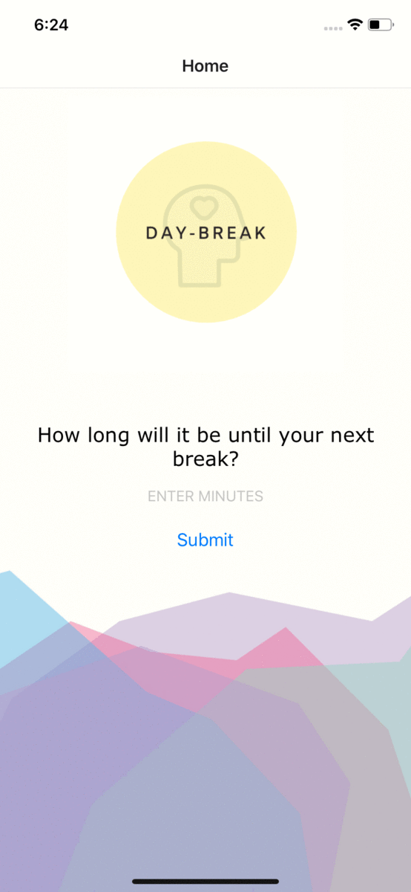

# Day-Break
Built in a 4-day Hackathon, Day-Break is a mobile appication that reminds you to take a break during your busy work day!

Enter the number of minutes before your next break, before long you'll be given a list of possible ways to spend your break. 




## How to use Day-Break:
To add some breaks to your day, simply clone this repo and :

```shell
git clone https://github.com/arng0123/Day-Break.git
npm install
npm start
```
